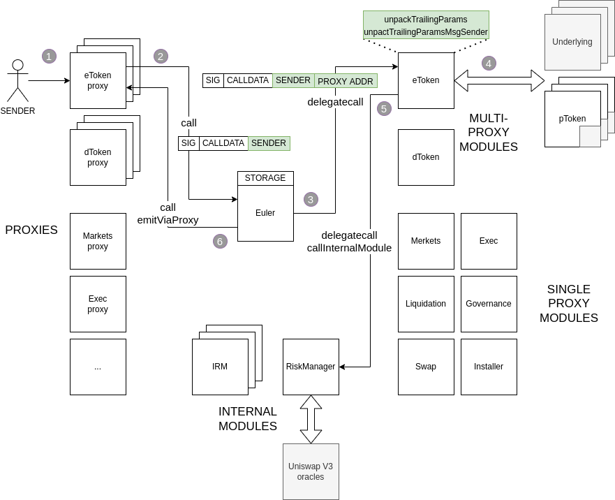

# Architecture

## Module System

Except for a small amount of dispatching logic (see `Euler.sol`), the contracts are organised into modules, which live in `contracts/modules/`.

There are several reasons why modules are used:

* A proxy indirection layer which is used for dispatching calls from sub-contracts like ETokens and DTokens (see below)
  * Each token must have its own address to conform to ERC-20, even though all storage lives inside the Euler contract
* Contract upgrades
  * Modules can be upgraded, which can immediately upgrade all ETokens (for example)
* Avoid hitting the max contract size limitation of \~24kb

See the file `contracts/Constants.sol` for the registry of module IDs. There are 3 categories of modules:

* **Single-proxy modules**: These are modules that are only accessible by a single address. For example, market activation is done by invoking a function on the single proxy for the Markets module.
* **Multi-proxy modules**: These are modules that have many addresses. For example, each EToken gets an address, but any calls to them are dispatched to the single EToken module instance.
* **Internal modules**: These are modules that are called internally by the Euler system and don't have any public proxies. These are only useful for their upgrade functionality, and the ability to stub in non-production code during testing/development. Examples are the RiskManager and interest rate model (IRM) modules.

Since modules are invoked by delegatecall, they should not have any storage-related initialisation in their constructors. The only thing that should be done in their constructors is to initialise immutable variables, since these are embedded into the contract's bytecode, not storage. Modules also should not define any storage variables. In the rare cases they need private storage (ie interest rate model state), they should use unstructured storage.

### Proxies

Modules cannot be called directly. Instead, they must be invoked through a proxy. All proxies are implemented by the same code: `contracts/Proxy.sol`. This is a very simple contract that forwards its requests to the main Euler contract address, along with the original msg.sender. The call is done with a normal `call()`, so the execution takes place within the Euler contract's storage context, not the proxy's.

Proxies contain the bare minimum amount of logic required for forwarding. This is because they are not upgradeable. They should ideally be small so as to minimise gas costs since many of them will be deployed (at least 2 per market activated).

The Euler contract ensures that all requests to it are from a known trusted proxy address. The only way that addresses can become known trusted is when the Euler contract itself creates them. In this way, the original msg.sender sent by the proxy can be trusted.

The only other thing that proxies do is to accept messages from the Euler contract that instruct them to issue log messages. For example, if an EToken proxy's `transfer` method is invoked, a `Transfer` event must be logged from the EToken proxy's address, not the main Euler address.

One important feature provided by the proxy/module system is that a single storage context (ie the main Euler contract) can have multiple possibly-colliding function ABI namespaces, which is not possible with systems like a conventional upgradeable proxy, or the Diamond standard. For example, Euler provides multiple ERC-20 interfaces but there is no worry that the `balanceOf()` methods of the ETokens and DTokens (which necessarily have the same selector) will collide.

For more details on the proxy protocol see `docs/proxy-protocol.md`.

### Dispatching

Other than the proxies, `contracts/Euler.sol` is the only other code that cannot be upgraded. It is the implementation of the main Euler contract. Essentially its only job is to be a placeholder address for the Euler storage, and to `delegatecall()` to the appropriate modules.

When it invokes a module, `contracts/Euler.sol:dispatch()` appends some extra data onto the end of the `msg.data` it receives from the proxy:

* Its own view of `msg.sender`, which corresponds to the address of the proxy.
* The `msgSender` passed in from the (trusted) proxy, which corresponds to the original `msg.sender` that invoked the proxy.

The reason it appends onto the end of the data is so that this extra information does not interfere with the ABI decoding that is done by the module: Solidity's ABI decoder is tolerant of extra trailing data and will ignore it. This allows us to use the module interfaces output from `solc` directly when communicating with the proxies, while still allowing the functions to extract the proxy addresses and original `msg.sender`s as seen by the proxies.

Since the modules are invoked by `delegatecall()`, the proxy address is typically available to module code as `msg.sender`, so why is it necessary to pass this in to the modules? It's because batch requests allow users to invoke methods without going through the proxies (see below).

## Modules

### Installer

The first module used is the installer module. This module is used to bootstrap install the rest of the modules, and can later on be used to upgrade modules to add new features and/or fix bugs.

Currently the functions are gated so that the `upgradeAdmin` address is the only address that can upgrade modules. However, the installer module itself is also upgradeable, so this logic can be restricted as we move towards greater levels of decentralisation.

### EToken

Every market has an EToken. This is the primary interface for the tokenisation of **assets** in the Euler protocol:

* **deposit**: Transfer tokens from your wallet into Euler, and receive interest earning tokens in return.
* **withdraw**: Redeem your ETokens for the underlying tokens, which are transfered from Euler to your wallet, along with any interest accrued.

Additionally, ETokens provide an ERC-20 compliant interface which allows you to transfer and approve transfers of your ETokens, as is typical.

Like Compound, but unlike AAVE, these tokens have static balances. That is, accrued interest will not cause the value returned from `balanceOf` to increase. Rather, that fixed balance entitles you to reclaim more and more of the underlying asset as time progresses. Although the AAVE model is conceptually nicer, experience has shown that increasing balance tokens causes a lot of pain to integrators. In particular, if you transfer X ETokens into a pool contract and later withdraw that same X, you have not earned any interest and the pool has some left over dust ETokens that typically aren't allocated to anyone.

A downside of the Compound model is that the values returned from `balanceOf` are in internal bookkeeping units and don't really have any meaning to external users. There is of course a `balanceOfUnderlying` method (named the same as Compound's method, which may become a defacto standard) that returns the amount in terms of the underlying and _does_ increase block to block.

### DToken

Every market also has a DToken. This is the primary interface for the tokenisation of **debts** in the Euler protocol:

* **borrow**: If you have sufficient collateral, Euler sends you the underlying tokens and issues you a corresponding amount of debt tokens.
* **repay**: Transfer tokens from your wallet in order to burn the DTokens, which reduces your debt obligation.

DTokens also implement a partially ERC-20 compliant interface. Unlike AAVE, where these are non-transferrable, DTokens _can_ be transferred. The permissioning logic is the opposite of ETokens: While you can send your ETokens to anyone without their permission, with DTokens you can "take" anybody else's DTokens without their permission (assuming you have sufficient collateral). Similarly, just as you can approve another address to take some amount of your ETokens, you can use `approveDebt()` to grant another account permission to send you some amount of DTokens.

The `approveDebt()` name was used instead of the ERC-20 `approve()` due to concerns that some contracts might unintentionally allow themselves to receive "negative value" tokens.

As well as providing a flexible platform for debt trading and assignment, this system also permits easy transferring of debt positions between sub-accounts (see below).

Unlike ETokens, DToken balances _do_ increase block-to-block as interest is accrued. This means that in order to pay off a loan in full, you should specify MAX\_UINT256 as the amount to pay off, so that all interest accrued at the point the repay transaction is mined gets repaid. Note that most Euler methods accept this MAX\_UINT256 value to indicate that the contract should determine the maximum amount you can deposit/withdraw/borrow/repay at the time the transaction is mined.

In the code you will also see `INTERNAL_DEBT_PRECISION`. This is because DTokens are tracked at a greater precision versus ETokens (27 decimals versus 18) so that interest compounding is more accurate. However, to present a common external decimals amount, this internal precision is hidden from external users of the contract. Note that these decimal place amounts remain the same even if the underlying token uses fewer decimal places than 18 (see the Decimals Normalisation section below).

### Markets

This module allows you to activate new markets on the Euler protocol. Any token can be activated, as long as there exists a Uniswap 3 pair between it and the reference asset (WETH version 9 in the standard deployment, although any 18-decimal token could be used).

It also allows you to enter/exit markets, which controls which of your ETokens are used as collateral for your debts. This terminology was chosen deliberately to match Compound's, since many of our users will be familiar with Compound already.

Unlike Compound which keeps both an array and a mapping for each user, we only keep an array. Upon analysis we realised that almost every access to the mapping will be done inside a transaction that _also_ scans through the array (usually as a liquidity check) so the mapping was (nearly) redundant and we thus could eliminate an SSTORE when entering a market. Furthermore, instead of a normal length-prefixed storage array, we store the length in a packed slot that is loaded for other reasons. This saves an additional SSTORE since we don't need to update the array length, and saves and SLOAD on every liquidity check (more important post Berlin fork). Taking it one step further, there is also an optimisation where the first entered market address is stored in a special variable that is packed together with this length.

Finally, the markets module allows external users to query for market configuration parameters (ie collateral factors) and current states (ie interest rates).

### RiskManager

This is an internal module, meaning it is only called by other modules, and does not have a proxy entry point.

RiskManager is called when a market is activated, to get the default risk parameters for a newly created market. Also, it is called after every operation that could affect a user's liquidity (withdrawal, borrow, transferring E/DTokens, exiting a market, etc) to ensure that no liquidity violations have occurred. This logic could be implemented in BaseLogic, and would be slightly more efficient if so, but then upgrading the risk parameters would require upgrading nearly every other module.

In order to check liquidity, this module must retrieve prices of assets (see the Pricing section below).

### Governance

This module lets a particular privileged address update market configuration parameters, such as the TWAP intervals, borrow and collateral factors, and interest rate models.

Eventually this logic will be enhanced to support EUL-token driven governance.

### Liquidation

This module implements the liquidations system (see below).

### Exec

This module implements some of the more advanced ways of invoking the Euler contract (described futher below):

* Batch requests
* Deferred liquidity checks

It also has an entry point for querying detailed information about an account's liquidity status.

### Swap

This module allows users to swap their deposited underlying tokens on Uniswap V3 and 1inch DEXes. Under the hood, the tokens are swapped directly from the pool, thus saving gas, which would normally be spent to withdraw and deposit back the traded assets. From the user's perspective the swap will change the balances of their eTokens.

Paired with deferred liquidity check (see below), the swap module allows users to put on one-click leveraged long and short positions on any collateral vs collateral asset pairs and one-click leveraged short positions on any collateral vs non-collateral pairs.

Available swap methods:

* all four methods of [UniswapV3 SwapRouter](https://docs.uniswap.org/protocol/reference/periphery/SwapRouter)
* full 1inch aggregator functionality, integrated through [1Inch API](https://docs.1inch.io/api/quote-swap)

_Note: The Swap module may become deprecated in favor of the new SwapHub module._

### SwapHub

This module is a redesigned version of the `Swap` module. The improvements include:
* modular architecture, easily extendible to support additional DEXs
* support for rebasing and fee-on-transfer tokens, like stETH

`SwapHub` doesn't execute trades on its own. It relies on external swap handlers, which can be created by anyone and are not a part of the platform. 
The swap handlers are required to share a common interface, namely an `executeSwap` function which takes a `SwapParams` struct with the requested trade options.
It is up to the user to select a swap handler to use by passing its address to the module's function calls. The swap handlers receive a transfer of the sold token before being invoked, and are expected to return both the bought tokens as well as any unused input. The module's only responsibility is to process the trade and verify its results (tokens sold and received) fall within user specified bounds in terms of amounts requested and slippage settings. To support exact output swaps for rebasing and fee-on-transfer tokens, it is possible to set a maximum difference of tokens requested vs received: `exactOutTolerance`.

#### Swap handlers
Currently there are 3 swap handlers available in the Euler repository, executing trades on:
* Uniswap V3 through [SwapRouter](https://github.com/Uniswap/v3-periphery/blob/main/contracts/SwapRouter.sol)
* 1Inch
* Uniswap V2 and V3 using Uniswap's [smart order router](https://github.com/Uniswap/smart-order-router)

See [Swap Handlers](swap-handlers.md) for more details.

## Storage and Inheritance

Most of the modules inherit from `BaseLogic` which provides common lending logic related functionality. This contract inherits from `BaseModule`, which inherits from `Base`, which inherits from `Storage`.

Almost all the functions in the Base modules are declared as private or internal. This is necessary so that modules don't export unexpected functions, and also so that the solidity compiler can optimise away unneeded functions (not all modules use all functions).

`contracts/Storage.sol` contains the storage layout that is used by all modules. It is important that this match, since all modules are called with `delegatecall()` from the Euler contract context. Furthermore, it is important that upgrades preserve the storage ordering and offsets. The test `test/storage.js` has the beginning of an implementation to take the Soldity compiler's storage layout output and verify that it is consistent across upgrades. After we deploy our first version, we will "freeze" the storage layout and encode this in the `test/storage.js` test.

## Pricing

Euler uses Uniswap 3 as its default pricing oracle. In order to ensure that prices are not vulnerable to snapshot manipulation, this requires using the time-weighted average price (TWAP) of a recent time period.

When a market is activated, the RiskManager calls `increaseObservationCardinalityNext()` on the uniswap pool to increase the size of the uniswap oracle's ring buffer to a minimum size. By default this size is 144, because this is on-average sufficient to satisfy a TWAP window of 30 minutes, assuming 12.5 second block times.

The Euler contracts will try to retrieve prices averaged over the per-instrument `twapWindow` parameter. If it cannot be serviced because the oldest value in the ring buffer is too recent, it will use the oldest price available (which we have ensured is at least 144 blocks old).

Our blog series describes our pricing system in more detail: [https://medium.com/euler-xyz/prices-and-oracles-2da0126a138](https://medium.com/euler-xyz/prices-and-oracles-2da0126a138)

### Chainlink prices

To support the assets that do not have a WETH pair on Uniswap 3 or the pair has insufficient liquidity to provide secure TWAP oracle, Euler extended its pricing types to include Chainlink price feeds as the pricing source.

Chainlink is the most used data provider in the industry. It has a very good reputation and provides secure pricing feeds that are used by lending protocol industry leaders like Aave, Compound and others. Integration with Chainlink on Euler brings a reduction of the protocol's dependency on Uniswap. It lowers the oracle manipulation risks for those assets that have very little liquidity in WETH pair on Uniswap 3. Also, for all the assets that have the Chainlink oracle set as a price source, it reduces the gas usage for all the operations that require price fetching.

Learn more about Chainlink Price Feeds: [https://docs.chain.link/docs/using-chainlink-reference-contracts/](https://docs.chain.link/docs/using-chainlink-reference-contracts/)

### Pegged prices

An exception to the Uniswap 3 and Chainlink pricing above is for assets that are equivalent to the reference asset. These assets can have a pricing type of "pegged" which indicates their price is always 1:1 with the reference asset. Currently the only asset that is pegged _is_ the reference asset itself, which is WETH.

### Price forwarding

Another exception is for assets that are equivalent to another asset, in which case the pricing can be "forwarded". This is currently only used for [pTokens](architecture.md#PTokens).

## Liquidity Deferrals

Normally, upon the completion of an operation that could fail due to a collateral violation (ie taking out a loan, withdrawing ETokens, exiting a market), the user's liquidity must be checked. This is done immediately after each operation by calling `contracts/BaseLogic.sol:checkLiquidity()`, which calls the internal RiskManager module's `requireLiquidity()` which will revert the transaction if the account is insufficiently collateralised.

However, this pattern causes some sequences of operations to fail unnecessarily. For example, a user must deposit ETokens and enter the market first, before taking out a loan, even if this is done in the same atomic transaction.

Furthermore, this can result in needless gas consumption. Consider a user taking out two loans in the same transaction: If the liquidity is checked each time, that means two separate liquidity checks are done, each of which requires accessing prices, looping over the entered markets list, and computing the liquidity (net of assets and liabilities, converted to the reference asset, and scaled by corresponding collateral and borrow factors).

Liquidity deferral is a general purpose solution to this. Users (which must be smart contracts, but see Batch Requests below) can call the `deferLiquidityCheck()` function in the Exec module. This function disables all liquidity checking for a specified account, and then re-enters the caller by calling the `onDeferredLiquidityCheck()` function on `msg.sender`. While this callback is executing, `checkLiquidity()` will not bother checking the liquidity for the specified account. After the function returns, the liquidity will then be checked.

As well as gas optimisation, and normal use-cases like refinancing loans, this also allows users to take out [flash loans](https://medium.com/euler-xyz/prices-and-oracles-2da0126a138).

For flash loans in particular, the protocol provides an adaptor contract `FlashLoan`, which complies with the [ERC-3156](https://eips.ethereum.org/EIPS/eip-3156) standard. The adaptor internally uses liquidity deferral to borrow tokens and additionally requires that the loan is paid back in full within the transaction.

## eToken <> dToken Symmetry

The primary operations on eTokens and dTokens are deposit/withdraw and borrow/repay, respectively. However, there is another interface that in some ways is more fundamental: mint/burn. These operations work on both eTokens and dTokens simultaneously. A mint operation creates both eTokens and dTokens in equivalent amounts, and assigns both to the user. A burn operation destroys eTokens and dTokens in equivalent amounts. These operations can be thought of as borrowing from yourself and repaying yourself. Alternatively, eTokens and dTokens can be thought of as a sort of matter and anti-matter, appearing from "nowhere" when minted (no underlying tokens required) and cancelling one another out of existence when burned.

All of the primary operations can be re-conceptualised as variants of mint and burn. For example, if there were no borrow function, it could be implemented in terms of a mint and a withdraw: the mint would create both eTokens and dTokens, and then the withdraw would destroy the eTokens leaving just dTokens.

* **deposit**: mint, repay
* **withdraw**: borrow, burn
* **borrow**: mint, withdraw
* **repay**: deposit, burn

There are some practical advantages with the mint and burn operations. One of which is that it becomes possible to repay a loan with eTokens instead of the underlying by burning a corresponding amount of eTokens together with the dTokens from the loan. This may be useful when the underlying token is illiquid -- perhaps because it has been paused -- but there is still a market for eTokens (incidentally, the stability pools described in the liquidation section are examples of eToken to eToken markets).

With the Swap module, Euler users can swap one eToken for another by performing an external swap on Uniswap. This saves users gas by avoiding deposit/withdraw overhead. When combined with mint, allows the construction of leveraged positions without any underlying token ever transiting user wallets.

Another area where the eToken/dToken symmetry is exposed is liquidations. Instead of the liquidator sending borrowed tokens and receiving collateral, Euler's liquidation flow simply transfers borrowed dTokens and collateral eTokens from the violator to the liquidator. The liquidator will typically withdraw the collateral, exchange it, and then repay to destroy the dTokens, but this is not strictly necessary. The liquidator could choose to retain the debt if, for example, there is insufficient available collateral tokens in the pool, or the swapping conditions are temporarily sub-optimal.

## Sub Accounts

In order to prevent a problem inherent with borrowing multiple assets using the same backing collateral, it is sometimes necessary to "isolate" borrows. This is especially important for volatile and/or untrusted tokens that shouldn't have the capability to affect more stable tokens.

Euler implements this borrow isolation to protect lenders. However, this can lead to a suboptimal user experience. In the event a user wants to borrow multiple assets (and one or more are isolated), a separate wallet must be created and funded. Although there is nothing wrong with having many metamask accounts, this can be a bad experience, especially when they are using hardware wallets.

In order to improve on this, Euler supports the concept of sub-accounts. Every ethereum address has 256 sub-accounts on Euler (including the primary account). Each sub-account has a sub-account ID from 0-255, where 0 is the primary account's ID. In order to compute the sub-account addresses, the sub-account ID is treated as a `uint` and XORed (exclusive ORed) with the ethereum address.

Yes, this reduces the security of addresses by 8 bits, but creating multiple addresses in metamask also reduces security: if somebody is trying to brute-force one of your N>1 private keys, they have N times as many chances of succeeding per guess. Although it has to be admitted that the subaccount model is weaker because finding a private key for a subaccount gives access to _all_ subaccounts, but there is still a very comfortable security margin.

You only need to approve Euler once per token, and then you can then deposit/repay into any of your sub-accounts. No approvals are necessary to transfer assets or liabilities between sub-accounts. Operations can also be done to mutiple sub-accounts within a single transaction by using batch requests (see below).

The Euler UI will make it convenient to view at a glance the composition of your sub-accounts, and to rebalance collateral as needed to maintain your debt positions.

## Batch Requests

Sometimes it is useful to be able to do multiple operations within a single transaction. This can be useful to reduce gas overhead by amortising the fixed transaction costs, especially if the operations involve multiple writes to the same storage slots (post Istanbul fork) and/or multiple reads from the same storage slots (post Berlin fork). It can also be useful to add atomicity to a sequence of operations (either they all succeed or they all fail).

In Ethereum these benefits are available to smart contracts, but not EOAs (normal private/public keypair accounts). This is unfortunate because many users can't/won't deploy smart contract wallets.

As a partial solution to this, the `contracts/modules/Exec.sol:batchDispatch()` function allows a group of Euler interactions to be executed within a single blockchain transaction. This is a "partial" solution since users cannot execute arbitrary logic in between the interactions, but is nonetheless sufficient for a wide variety of use-cases.

For example, in order to provide collateral to Euler, two separate steps must occur: Depositing into the EToken, and entering the market for that EToken. Rather than requiring users to make two separate transactions, or implementing a hypothetical `depositAndEnter()` function (which would imply a combinatorial explosion of method combinations), batch transactions can be employed.

Additionally, liquidity checks can be deferred on one or more accounts in a batch transaction. This can provide significant gas cost savings and can allow flash-loan-like rebalancing without the need for a smart contract. We are planning on implementing a built-in swap functionality that will convert one EToken to another by performing a swap on Uniswap. This would be very gas-efficient since tokens do not need to be moved from external wallets to and from Euler's wallet, and would also allow an easy way to create leveraged positions, even for EOA users.

## Reserves

Similar to Compound and AAVE, a proportion of the interest earned in a pool is collected by the protocol as a fee. Euler again uses the same terminology as Compound, calling the aggregate amount of collected fees the "reserve". These fees are controlled by governance, and may be paid out to EUL token holders, used to compensate lenders should pools become insolvent, or applied to other uses that benefit the protocol.

Reserves provide a buffer of funds that can cover losses due to positions that are too small to liquidate, and can also be a source of funds for governance to implement insurance, distribute to EUL stakers, or apply to some other purpose that benefits the protocol.

Unlike Compound where the reserves are denominated in the underlying, Euler's reserves are stored in the internal bookkeeping units that represent EToken balances. This means that they accrue interest over time, as with any other EToken deposit. Of course, Compound governance could periodically choose to withdraw their reserves and re-deposit them in the pool to earn this interest, but in Euler it happens automatically and continuously. Similar to Euler, AAVE deposits earned reserve interest into a special treasury account that owns the aTokens, however this is much less efficient than the special-cased reserves model of Compound/Euler, involving several cross-contract calls. In Euler, the reserves overhead is primarily two SSTORE operations, to slots that would be written to anyway.

When we issue "eTokens" to the reserve, it inflates the eToken supply (making them less valuable). However, we only do this after we increase totalBorrows, ensuring that the inflation is less than what was earned as interest, proportional to the reserve fee configured for that asset.

### Derivation of Reserves Formulas

#### Compound

In Compound, the assets owned by CToken holders are the total "cash" (unallocated underlying units in the pool) plus the total outstanding borrows (which increase as interest is accrued), minus the total reserves (which are owned by Compound governance):

```
assetsCompound = totalCash + totalBorrows - totalReserves
```

Prior to most operations, the `accruedInterest` since the last operation is computed. In Compound, this is added to `totalBorrows`, and `accruedInterest * reserveFactor` is added to `totalReserves`, resulting in new value for the assets:

```
newAssetsCompound = assets + accruedInterest - (accruedInterest * reserveFactor)
```

Compound's `totalReserves` is in units of the underlying, so it does not accrue interest, however governance could vote to withdraw these reserves and re-deposit them in exchange for CTokens, which would.

If `totalSupply` is the sum of the balances of all CToken holders, the exchange rate between these CToken balances and the underlying token is:

```
newExchangeRateCompound = newAssetsCompound / totalSupply
```

#### Euler

After applying interest, the new exchange rate is the same for both Compound and Euler, although how it is computed differs. Rather than deducting the reserve fees from the `newAssets`, Euler increases `totalSupply`. So the new value for assets is computed as though no reserve fees were being deducted:

```
newAssetsEuler = assets + accruedInterest
```

In Euler, reserves are tracked in EToken units which means they earn interest automatically. When interest is accrued it is added to `totalBorrows` in the same way as Compound. But then, instead of adding the collected fee to `totalReserves` (causing it to be deducted from `newAssetsCompound`), a special number of new ETokens are minted and credited to the reserves, which increases `totalSupply`. This number of newly minted ETokens is selected so as to inflate the supply just enough to divert a `reserveFactor` proportion of the interest away from EToken holders to the reserves.

In order to show that this results in the same exchange rate as Compound's method, we can derive the algorithm that Euler uses to compute `newTotalSupply` using Compound's value:

```
newExchangeRate = newAssetsEuler / newTotalSupply

newTotalSupply = newAssetsEuler / newExchangeRate
```

Substituting in Compound's value for `newExchangeRate`:

```
newTotalSupply = newAssetsEuler / (newAssetsCompound / totalSupply)

newTotalSupply = newAssetsEuler / ((assets + accruedInterest - (accruedInterest * reserveFactor)) / totalSupply)
```

Simplifying:

```
newTotalSupply = totalSupply * newAssetsEuler / (newAssetsEuler - (accruedInterest * reserveFactor))
```

Finally, the reserve balance (denominated in ETokens) is increased by `newTotalSupply - totalSupply`.

This is the algorithm used in the code, except for operation re-ordering done to avoid rounding truncation.

## PTokens

"Protected" tokens exist to provide users the option to deposit tokens and use them as collateral, while not permitting them to be loaned out. PTokens provide users with additional safety, at the expense of not earning any interest on the deposited asset. PToken depositors don't need to worry about a pool becoming insolvent, or that their assets will be loaned out when they wish to retrieve them.

Rather than applying this as universal setting on an asset, it is up to the user to decide whether they want to protect their collateral. Since Euler only supports one eToken per underlying asset, a token wrapper contract is used. Users first wrap their underlying tokens into pTokens, and then deposit these pTokens into Euler, receiving "epTokens" which can then be used for collateral.

Another use-case of pTokens is to prevent tokens from being borrowed to perform governance-related attacks. Because the borrowing-prevention check happens inside `increaseBorrow()` (and not in `checkLiquidity()`), pTokens cannot even be flash borrowed.

## Interest rate models

FIXME: describe

## Liquidations

Borrowers must maintain sufficient collateral in order to support their borrows. In particular, each account must maintain a "health score" above 1. The health score is computed by dividing the account's [risk-adjusted](https://github.com/euler-xyz/euler-docs/tree/ce95fcac4a5d619eec6a8ad50fddc5b50f0db6c5/getting-started/white-paper/README.md#risk-adjusted-borrowing-capacity) collateral value by its risk-adjusted liability value. Since the collateral factor decreases the effective value of the collateral, and the borrow factor increases the effective value of the liability, when the health score is 1, then the account is still technically solvent (assets are worth more than liability), but the account is said to be in "violation".

When an account is in violation, the `liquidate()` method of the Liquidation module can be invoked by anyone (except by the violating account itself, to avoid aliasing bugs). The account invoking this method is called the "liquidator". This method does two things:

1. Transfers some DTokens from the violator to the liquidator. This represents debt that is being taken over by the liquidator.
2. Transfers some ETokens from the violator to the liquidator. This represents the collateral being seized by the liquidator in exchange for taking the debt.

Because of the collateral and borrow factors, reducing the assets and liabilities in equal values (relative to the reference asset ETH) will result in a user's health score increasing (except in certain pathological circumstances). The amount of DTokens/ETokens is selected to be just enough to return a user to a higher health score, by default 1.25. This is what is referred to as a [soft liquidation](https://github.com/euler-xyz/euler-docs/tree/ce95fcac4a5d619eec6a8ad50fddc5b50f0db6c5/getting-started/white-paper/README.md#soft-liquidations), in contrast with the simpler method of liquidating a fixed proportion of the loan.

Since the liquidator is taking on debt, the liquidating account's liquidity must be checked after a liquidation. Typically a liquidator will be a smart contract so it can atomically perform other operations in addition to the liquidation, and in particular can [defer the liquidity check](architecture.md#liquidity-deferrals) to later in the same transaction, allowing "flash liquidations".

Liquidation bots that wish to operate without capital requirements may follow the following pattern for liquidations:

* Defer liquidity check
* Liquidate an account, receiving underlying DTokens and collateral ETokens
* Withdraw enough of the collateral to repay the debt
* Convert this collateral on a decentralised exchange such as Uniswap
* Repay the debt, zeroing-out the DToken balance

At this point, there is no outstanding debt so the deferred liquidity check will succeed. Any left over ETokens are profit, and can be held by the liquidation smart contract or transferred to another account.

### Dynamic discounts

If the seized debt and collateral were each worth the same in terms of a reference asset (for example ETH), then there would be no point in performing liquidations. In order to incentivise liquidators, the amount of collateral seized is increased by a certain factor. Since the violator is effectively receiving a lower price for purchasing collateral, this factor is known as a "discount".

Euler uses a dynamic value for this discount rather than a fixed value. The discount increases by how far the violator's health score has decreased below `1`. For example, if an account's health score has fallen to `0.98`, then the discount received is `1 - 0.98 = 0.02`, or 2%.

Euler uses Uniswap3 TWAPs for the price feeds of all assets which has the property in which the prices on the protocol change smoothly over time. This is central to how the dynamic discount is designed to work, and creates a Dutch auction-like mechanism that finds the lowest possible market-clearing discount level.

#### Dynamic discount example

Let's suppose a borrower has a health score of `1.1` and then a large swap is performed on a borrowed asset which increases its current price on Uniswap significantly. Immediately after this swap (ie, throughout the rest of the block the swap was included in) then the TWAP of the asset is unchanged (since no time has passed). This means that the account's health score is also unchanged.

However, as time goes on and the weight of the new price increases, then the TWAP will increase which means that the health score will decrease (the liability is becoming more valuable). Note that this in fact happens at second-granularity. If the swap was large enough, then at some point in the future the averaged price will be such that the health score is exactly equal to `1`. Assuming that the TWAP hasn't yet caught up with the current price, then in any subsequent block the health score will be below `1` and there will therefore be a liquidation opportunity.

Now, at this point, the discount will be extremely small. If the health score is `0.999` then the discount would be a mere 0.1%. This level of discount is most likely not enough to make a liquidation worth-while. First of all, because the prices used to calculate the equivalent values of assets are TWAPs, they don't yet take into account the current (non-averaged) price of the underlying asset. Secondly, the discount must compensate the liquidator for any execution slippage, gas costs, and other operational overhead.

All of this is to say that it is unlikely that anybody will perform the liquidation at this point. But as time goes on and the TWAP increases, the health score decreases and the discount improves. At some instant in time a bot will determine that the current discount will result in a profitable liquidation. At this point it has two options: it can either execute the liquidation and take the small profit, or wait until the discount increases further. If the bot waits then it risks losing the liquidation opportunity to another liquidator.

### Reserves

When a liquidation happens, a small amount of additional borrowed asset beyond the soft-liquidation amount must be repaid by the liquidator (which is compensated by a corresponding extra discount amount). This additional amount is credited to the borrowed asset's reserves.

This is done to pad the reserves for assets that are frequently liquidated, since this may be indicative of volatile asset which may have a higher risk of accruing bad debt.

Another option could have been to pad the reserves of the collateral asset, however on Euler not all assets can be used as collateral so many pools would have no opportunity for their reserves to be increased in this manner.

### Front-running protection

The Dutch auction-like mechanism described above can provide a discount to anyone who calls `liquidate()`. This means that liquidations are permission-less which is desirable for various reasons, not least of which because liquidations cannot be censored.

However, permissionless liquidations are often affected by so-called "front-running". This is when a bot sees a profitable new transaction and submits it for themselves with a higher gas price. While front-running isn't directly a problem for the protocol, it can be detrimental for the ecosystem:

* The capture of value by miners means that it is less profitable to operate liquidation bots, so there may be fewer people doing so, and those who do may be less aggressive.
* A lot of resources are wasted on failed transactions and bidding up the gas prices of liquidations.

In Euler we would like to reward the operators of liquidation bots instead of miners, and reduce their level of reward to the minimal level that a competitive market will bear. In order to do this, an extra "bonus" is applied to the discount for users who have assets deposited into the Euler protocol. This bonus works by increasing the slope of the discount. For instance, if a user has enough assets deposited to provide a 2x bonus, then instead of getting a 1% discount, they would get a 2% discount.

If you are operating a liquidation bot, you can become profitable before front-running bots by keeping a balance of non-zero collateral factor assets. In order to receive a full bonus, your risk-adjusted collateral should be at least equal to the risk-adjusted value of the liquidation you are processing (anything less will result in a smaller bonus).

With bonuses and the Dutch action mechanism, our hope is that gas auctions will be rare, and the majority of the value of liquidations will accrue to users who benefit the protocol by supplying assets.

Note that the liquidity used to claim a bonus must be held in the Euler contracts for a period of time. The full averaged liquidity will be achieved after a day (see [Average Liquidity Tracking](architecture.md#average-liquidity-tracking). This means that no bonus will be applied if someone atomically supply liquidity, liquidates, and then withdraws.

## Functional Diagram



The functional diagram depicts the smart contract architecture and how proxies, the Euler contract and modules relate to each other.

Let's follow an execution of the `deposit` function on an eToken.

1. The user calls `deposit` on an eToken proxy of the underlying she wants to deposit to Euler.
2. The proxy attaches `msg.sender` to the call data and calls `dispatch` on `Euler` contract in the `fallback` function.
3. Through a lookup of the proxy address `Euler` finds the currently installed module implementation for an eToken and delegate-calls it, attaching the proxy address to the call data.
4. The `deposit` function in `EToken` module contract unpacks the trailing params from call data to determine the original sender's address. The proxy address determines the underlying of the eToken, which the `deposit` function pulls from the user's wallet. An underlying of an `eToken` can be a `pToken`, which wraps a collateral asset.
5. Internal modules `IRM` and `RiskManager` are delegate-called to compute the new interest rate and check the account health.
6. Finally `emitViaProxy` function is called to emit standard `Transfer` event from the proxy address in compliance with ERC20. The proxy only allows this if the `msg.sender` is the `Euler` contract.

## Misc Details

### Average Liquidity Tracking

In order to provide a liquidation discount that privileges investors in the system, Euler can optionally track the liquidity of an account. In order to opt-in to this, an account should call the `trackAverageLiquidity()` function in the `exec` module. This will cause most operations such as depositing and withdrawing to consume more gas, but will make the account eligible for extra discount privileges, if it participates in liquidations.

The actual value that is tracked is the risk adjusted liquidity, that is, after applying collateral factors and borrow factors. So, only assets with non-zero collateral factors will contribute to the liquidity. Similarly, outstanding borrows will reduce the average liquidity.

In order to prevent a user (or front-running bot) from simply depositing a large amount prior to a liquidation (perhaps using a flash loan), the average value of the liquidity over a period of time is tracked. For example, immediately after depositing for the first time, your average liquidity will be 0. Only after `AVERAGE_LIQUIDITY_PERIOD` seconds have elapsed will your full liquidity value be reflected.

The averaging is implemented with an exponential moving average, that is updated with the current liquidity value before any operation (such as deposit) is performed. This is not perfect, since the average liquidity will not reflect price movements between updates. Also, a user could opportunistically cause an update when prices are exceptionally high or low, although the prices are of course TWAPs so are more difficult to manipulate.

We don't believe these limitations will be significant with respect to the use case described above. That said, if enabled, the average liquidity for an account is available with `exec.getUpdatedAverageLiquidity()`, so long as your application can accept the limitations described above.

### Decimals

The ERC-20 specification allows contracts to choose the number of decimal places that a token supports. This is now widely regarded as problematic, since it causes a lot of annoying integration work (see ERC-777 for an interesting alternative).

Rather than exposing this to our system, we have decided to normalise the decimals up to 18 for all tokens (Euler for now does not support tokens with > 18 decimals). As well as simplifying our contract and off-chain logic, this allows more precise interest accrual.

### Rounding

Debts are always rounded _up_ to the smallest possible external unit (1 "wei" on 18 decimal tokens). This means that after any interest at all is accrued (ie, after 1 second), borrowers already owe at least 1 unit. When you repay, this extra fraction is added to the EToken pool. This works because debt amounts are tracked at a higher precision (27 decimals) than the external units (0-18 decimals).

### Compounding behaviour

Unlike Compound, where the compounding occurs whenever a user interacts with a token, Euler compounds deterministically every second. The amounts owed/earned are independent of how often the contract is interacted with, except of course for interactions that result in interest rate changes. As mentioned, the compounding precision is done to 27 decimal places, according to the current interest rate in effect (determined by the interest rate model).

In the Compound system, interest accumulators are opportunistically updated for all operations that affect assets, which is necessary because this is how compounding is achieved (simple interest being charged between updates). Because Euler precisely tracks the per-second compounded balance, there is no advantage to updating the accumulator frequently, and therefore Euler does it lazily only when it actually needs to (before operations that affect debt obligation balances). So as well as being more accurate, this means that fewer storage writes are needed.

### External access to interest accumulators

There is a method in the markets module, `interestAccumulator()` that retrieves the current interest accumulator for an asset. Because the accumulators are updated lazily as described above, rather than just returning the stored value, this method computes the updated accumulator given the most recent block's timestamp (sometimes called a "counterfactual" value).

Although the returned values are in opaque internal units, they can be used to determine the accumulated interest over time by comparing snapshots. This is sort of like using Uniswap-style "TWAPs": By dividing a recent snapshot by an older snapshot, the actual amount of interest collected between those two time periods is computed.

### Unusual/Malicious tokens

We try to work as well as possible with "deflationary" tokens. These are tokens where when you request a transfer for X, fewer than X tokens are actually transferred. For these, we check the Euler contract's balance in the token before and after to determine how much was transferred.

Relatedly, on some tokens the `balanceOf` method can return different results with no intervening operations. In this case, the total pool available to owners of ETokens of these underlyings will be affected, but the protocol itself will not be (assuming such tokens have collateral factors of 0, which is the default).

Since we allow arbitrary tokens to be activated, our threat model is larger than that of Compound/AAVE. We need to worry about misbehaving tokens, even one-off tokens written specifically to attempt theft from the protocol. See the file `docs/attacks.md` for some more notes on the threat modelling.

Tokens may return extremely large values in an attempt to cause math overflows. This could be disastrous, especially if a user could cause their own liquidity checks to fail. In this case, a user could create an un-liquidateable position. To prevent this, when we receive a very large result from `balanceOf`, we treat that result as though it were 0 (which a malicious token could also do of course). This way liquidity checks will at least succeed, allowing non-malicious collaterals to be liquidated.
