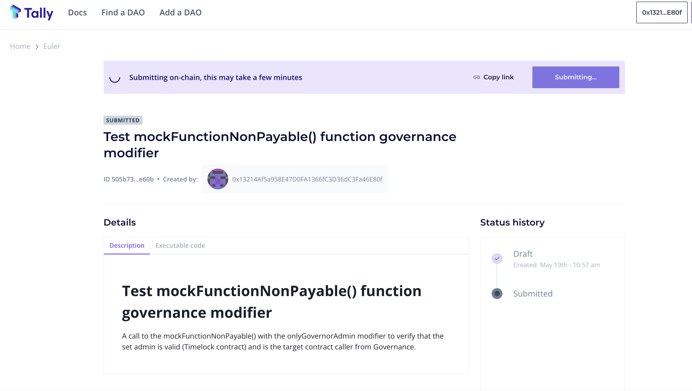

# Create a Tally (On-Chain) Proposal

## About

On-Chain governance actions (proposal, voting, etc.) for the Euler protocol can be done via the [Tally](create-a-tally-on-chain-proposal.md#tally) governance dashboard (described below).

Tally is a web-based governance application focused on enabling on-chain governance. The Tally governance web application [provides transparency around the governance of various DeFi protocols, e.g., Compound, Uniswap, etc.](https://docs.tally.xyz/) bringing all of the proposals and voting for these protocols under a shared user interface.

Tally empowers user owned governance through a voting dashboard, governance tooling, and real time research and analysis. Users can use the app to review data on governance systems, active and prior proposals, and individual delegates or token holders. The platform also enabled direct on-chain voting and vote delegation, helping users put their governance insights into action. Through integration with the Euler governance smart contract, Euler token holders can connect their wallets and create proposals, vote, delegate voting power to a community member, discover other delegates in the community, and more.

The [Euler Governance Dashboard](https://www.tally.xyz/governance/eip155:1:0xd8E2114f6bCbaee83CDEB1bD6650a28BBcF144D5) can be accessed on Tally. The guide below demonstrates how to created an on-chain governance proposal on this dashboard.

## Step-by-step

1\. Visit the [Euler on-chain governance dashboard](https://www.tally.xyz/governance/eip155:1:0xd8E2114f6bCbaee83CDEB1bD6650a28BBcF144D5) on Tally and connect your wallet where you have EUL voting power (see the how to guide on `Delegate Voting Power` for how to get voting power).

2\. To create a new proposal, click on `Create New Proposal` from the DAO home page on Tally as shown in the top right corner in the image below.

This will then open up the proposal creation dialog taking users through the required steps to create an on-chain proposal. In the initial step / screen, it will check that the user has enough voting power to meet the proposal threshold specified within the governance smart contract.

3\. The `Continue` button shown above will become active if the connected wallet has the reqired voting power that meets the proposal threshold. Upon clicking continue, you will be presented with a form to input the proposal name and add a short description as shown below.

4\. Users will need to add the actions to be executed should the proposal become successful or receive majority of vote in support. In this step, users can specify the target smart contract address, smart contract function and required function parameters. Up to a maximum of 10 actions can be added in a single proposal.

5\. The following page will then be the review page allowing the user to review and confirm that the specified actions are correct:

Once confirmed, the proposal will then be created on-chain and if successful, Tally will display the proposal page with the description and status as it progresses (e.g., pending, active, succeeded, queued, executed).

&#x20;

<figure><figcaption></figcaption></figure>

Full Tally documentation can be accessed online at: [Tally](https://docs.withtally.com). The documentation describes how to navigate the web app, voting and delegation and creating a Tally account.
