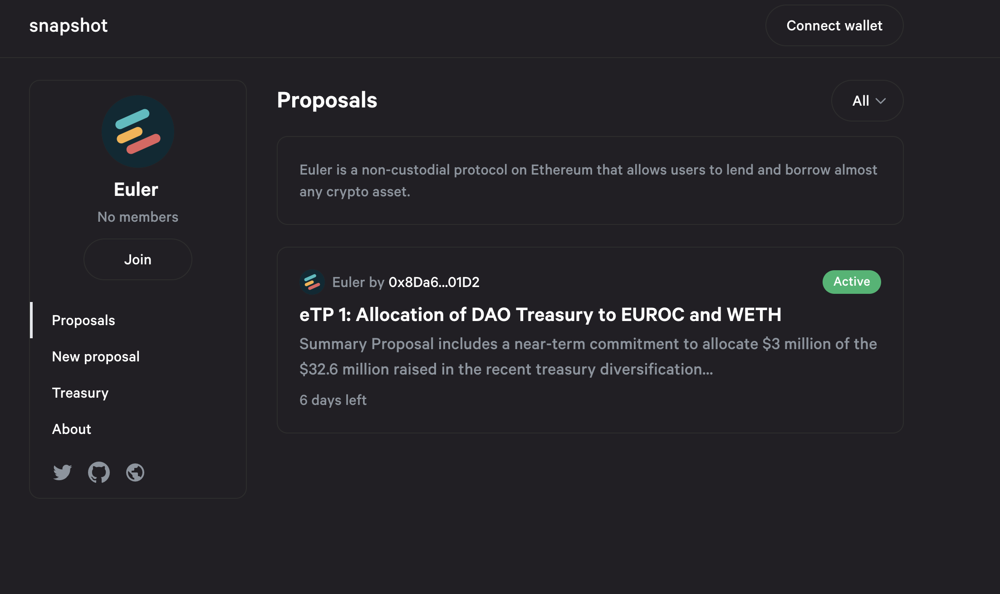
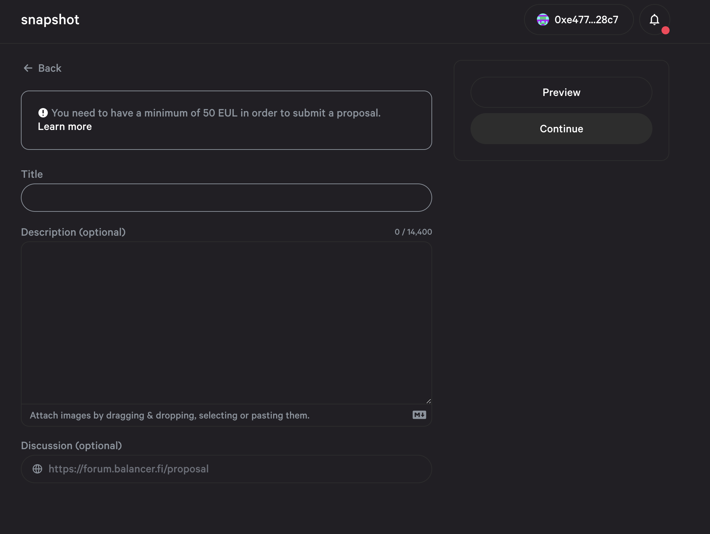

# Create a Snapshot (Off-Chain) Proposal

## About

Off-chain governance actions (proposal, voting, etc.) for the Euler protocol can be done via the [Snapshot](create-a-snapshot-off-chain-proposal.md#snapshot) governance dashboard (described below). For off-chain governance, there is no code to review or implement as such. It is mainly a call for the Euler Foundation to carry out an action. Issue a grant, or pay a bill, for example. Thus mainly used to aid Euler in making difficult decisions in collaboration with the community.

[Snapshot](https://snapshot.org/#/) is an off-chain, 'gasless', multi-governance community polling dashboard used by a number of decentralised finance projects including the likes of Aave and Balancer.

It provides a simple interface to create governance proposals and lets users vote on them by connecting their wallets and the governance tokens contained within. However, the actual voting process is conducted off-chain to save on gas costs and complexity to enable community members 'signal' their preferences on proposals before any on-chain actions or governance process.

The [Euler Governance Dashbaord](https://snapshot.org/#/eulerdao.eth) can be accessed on Snapshot.

## Step-by-step

1\. Navigate to the [Euler](https://snapshot.org/#/eulerdao.eth) home page on Snapshot and connect your wallet where you have EUL voting power. You should see the Euler space home page as shown below.

⚠️ _You CANNOT vote if you have not delegated your token., You have to either delegate your token power to yourself or a delegate in order to vote in governance. Self-delegate or delegate to others_ [_here_](https://app.euler.finance/delegates)_._

2\. Click on `New proposal` on the left hand side of the window of the Euler space home page (shown above). It should open up the new proposal form for you to complete which looks like this:

It will also check your connected wallet for voting power and let you know the current proposal threshold.&#x20;

3\. Enter the proposal title.

4\. Enter the proposal description (it can be formatted using markdown) and you can also enter a link at the bottom pointing to your proposal on the Euler Governance Forum on Discourse.

5\. Click on `Continue` after previewing your proposal and go to the `Actions` box and select the voting type and start date of your proposal (end date will be shown based on the current voting period settings). The proposal creation block number is the snapshot where the voting power of voters will be counted.

6\. Click on `Publish` and your proposal will be created. You will be prompted by Metamask to sign a transaction which is free and the proposal will then become active on Snapshot.

Full Snapshot documentation can be accessed via the [Snapshot documentation site](https://docs.snapshot.org).
