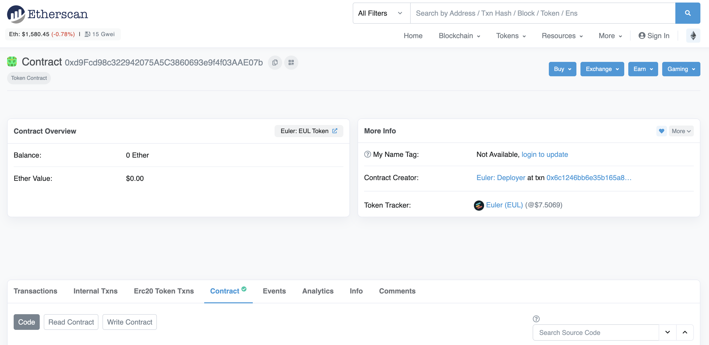
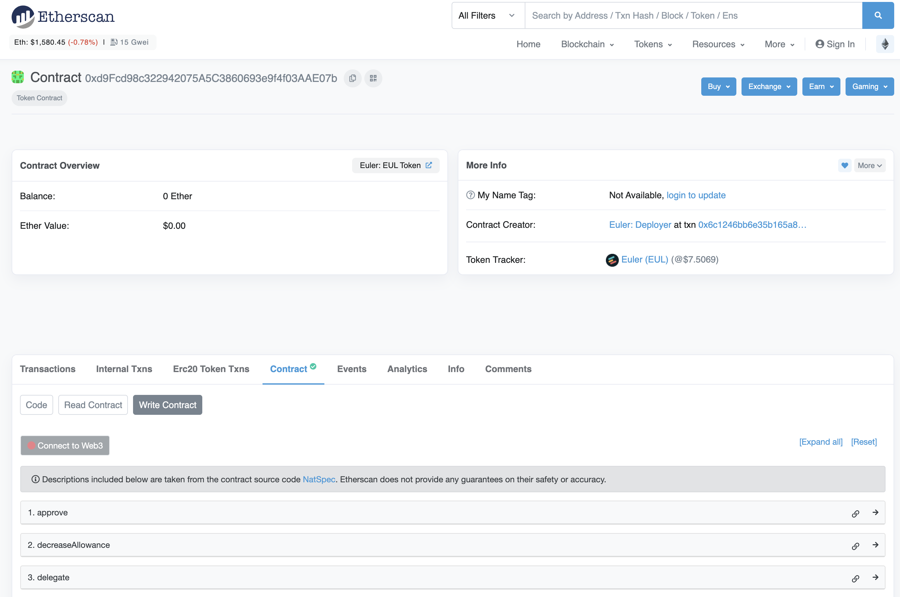
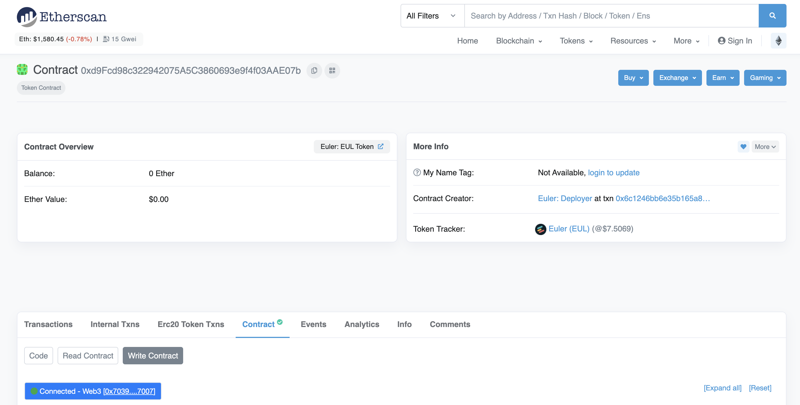
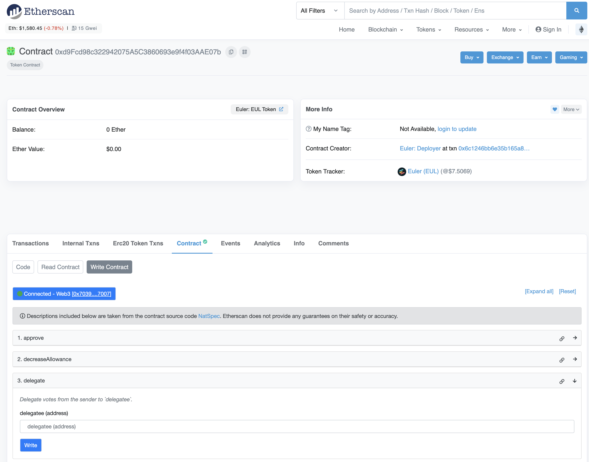
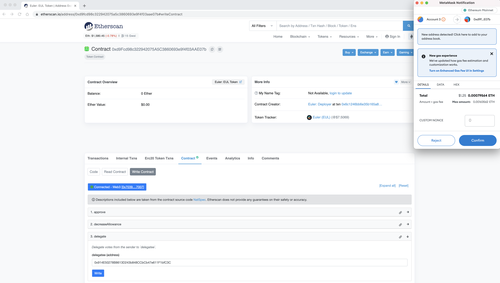
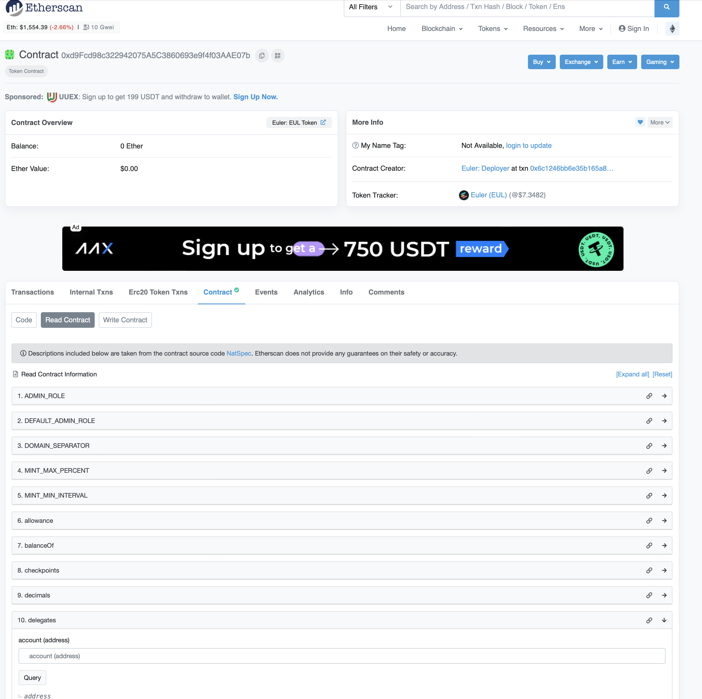
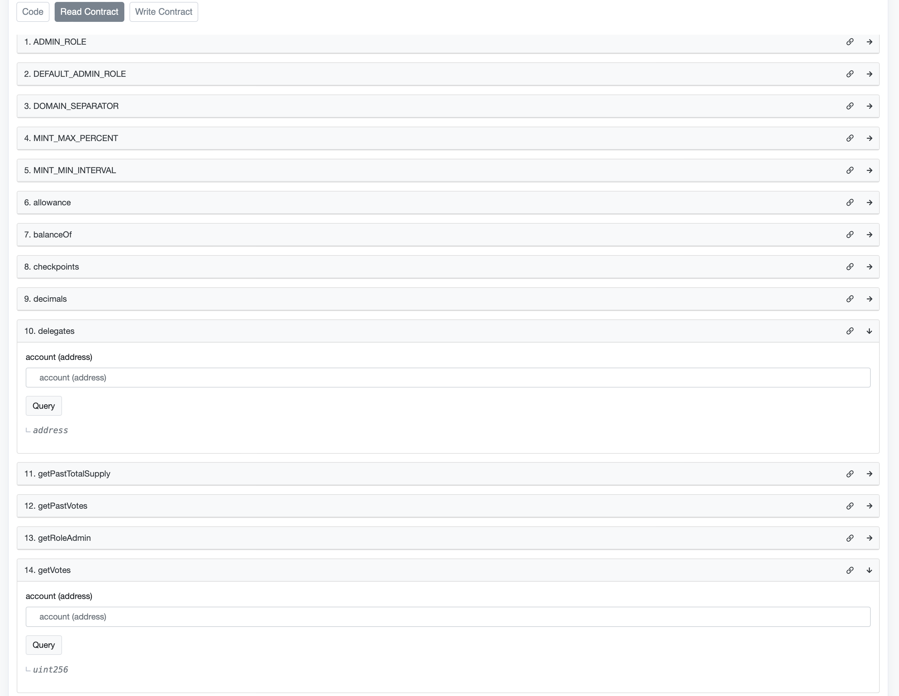

# Delegate Voting Power

🚨 _If you wish to have a say in governance, you need to delegate your voting power to yourself or someone in the community. Without performing this action, you will not have any voting power which means being unable to create proposals or vote on Snapshot (off-chain) and Tally (on-chain)._ 🚨

## About

In summary, delegates are token holders that have completed a one-time setup process (executing the delegate function of the token to delegate another user or the token holder themselves to enable the governor contract to determine their voting power). Once you become a delegate, you can vote on active proposals, and create proposals if you have enough voting power. If you choose not to directly vote on proposals, you can pass your voting power on to a delegate as well.

The delegate sections below describe the delegation using the EUL token smart contract and via the Tally Governance Dashboard.

Delegate votes from the sender to a delegatee. Users can delegate to 1 address at a time, and the number of votes added to the delegatee’s vote count is equivalent to the balance of EUL in the user’s account. Votes are delegated from the current block and onward, until the sender delegates again, or transfers their EUL. Delegation can be carried out via the smart contract function described below or via the Tally user interface.


## Step-by-step

Voting power delegation can be done via Etherscan, Tally (On-Chain) Governance dashboard or programmatically.


### Etherscan

1\. Visit the [EUL token page](https://etherscan.io/address/0xd9fcd98c322942075a5c3860693e9f4f03aae07b) on Etherscan (shown below).

<figure><figcaption></figcaption></figure>

2\. Click on `Contract` (shown below) to view the EUL token smart contract code and interact with the contract via etherscan.

<figure><figcaption></figcaption></figure>

3\. Click on `Write Contract` (shown below).

<figure><figcaption></figcaption></figure>

4\. Click `Connect to Web3` to connect your Metamask wallet which will be used to confirm the delegate transaction. Once connected, you should see your wallet connect on etherscan as shown below.

<figure><figcaption></figcaption></figure>

5\. Click on `3. delegate` to expand the delegatee address input text field.

<figure><figcaption></figcaption></figure>

6\. Enter the address you wish to delegate your voting power to. This can be your wallet address if you are self-delegating or another wallet address (i.e., a community member or one of the active delegates on the [delegates list](https://app.euler.finance/delegates).&#x20;

7\. Click on the blue `Write` button directly under the delegatee address text field.

8\. Finally, regardless of whether you are delegating to yourself or delegating to a delegate, you will be required to confirm the transaction in your Metamask wallet and this transaction will cost gas.

<figure><figcaption></figcaption></figure>

To check the address you are currently delegated to, you can click on the `Read Contract` tab next to the `Write Contract` tab and you will be presented with the window below.

<figure><figcaption></figcaption></figure>

Click on `10. delegates` (shown below) and paste your address in the text field and click on `Query` and it should show the address you have set as a delegate. If it shows the zero address, (i.e., 0x0000000000000000000000000000000000000000) then it implies you have not delegated to your wallet or to another address.

You can also check your current voting power.&#x20;

To do this, click on `14. getVotes` (shown below) and paste your address in the text field and click on `Query`. If you have self-delegated, your voting power should be equal to the number of tokens you hold. If you have not self-delegated, or if you have delegated to another address, the query will return zero voting power.

<figure><figcaption></figcaption></figure>


### Tally (On-Chain) Governance Dashboard

1\. Visit the [Euler on-chain governance dashboard](https://www.tally.xyz/governance/eip155:1:0xd8E2114f6bCbaee83CDEB1bD6650a28BBcF144D5) on Tally and connect your wallet where you hold EUL tokens.


2\. Click on `Delegate vote` at the top right corner of the screen.

3\. A pop-up window will appear with two options as shown below, i.e., Delegate to self or Delegate to an address. You can then choose on of these options from the pop up window, either to delegate to yourself or to another wallet address (i.e., a community member or one of the active delegates on the [delegates list](https://app.euler.finance/delegates)). By delegating to self, you retain your voting power. Next time there is an active proposal, you can choose to vote in any way you choose.


If you choose to delegate to an address or delegate, the following screen will be shown instead where you can enter the address you wish to delegate your voting power to.


This will not transfer any of your EUL tokens to the delegate, but rather only delegate all your voting power, i.e., you will be voting via a delegate or proxy who will be voting on your behalf or representing you at the polls!&#x20;

You can always change the delegate later on or delegate to yourself again. This helps to ensure that there is a good degree of participation from the community on on-chain governance proposals voting.

4\. Finally, regardless of whether you are delegating to yourself or delegating to a delegate, you will be required to confirm the transaction in your Metamask wallet and this transaction will cost gas.


To recap, delegates are token holders that have completed a one-time setup process. Once you become a delegate, you can then vote on active proposals, and create proposals if you have enough voting power. If you choose not to directly vote on proposals, you can pass your voting power on to a delegate as we have seen.

####

### Programmatically

For developers who wish to interact with the EUL token smart contract directly, the EUL contract has a delegate function defined with examples on how to interact with it shown below.

```
function delegate(address delegatee)
```

* `delegatee`: The address the sender wishes to delegate their votes to.
* `msg.sender`: The address of the EUL token holder that is attempting to delegate their votes.
* `RETURN`: No return.

#### Solidity

```
EUL eul = EUL(0x123...); // contract address
eul.delegate(delegateeAddress);
```

#### Web3.js

```
const tx = await eul.methods.delegate(delegateeAddress).send({ from: sender });
```
