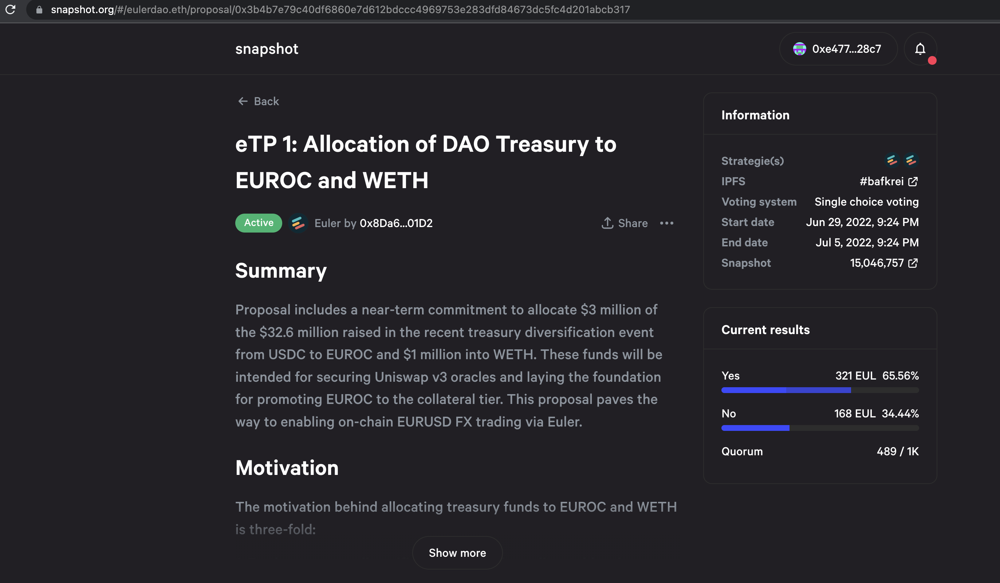
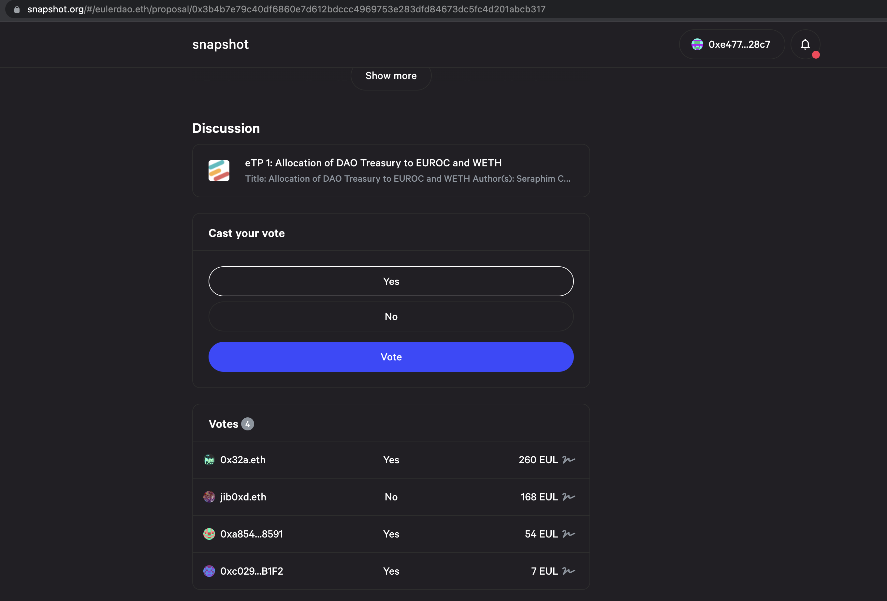

# Vote on Snapshot (Off-Chain)

## About

This guide describes how to cast a vote on a proposal (off-chain) created on Snapshot.

## Step-by-step

1\. Navigate to the [Euler](https://snapshot.org/#/eulerdao.eth) home page on Snapshot and connect your wallet where you have EUL voting power.

⚠️ _You CANNOT vote if you have not delegated your token., You have to either delegate your token power to yourself or a delegate in order to vote in governance. Self-delegate or delegate to others_ [_here_](https://app.euler.finance/delegates)_._

2\. Click on an active proposal of your choice to view more details and see the voting options (as well as existing votes).

Scrolling down on the page, you will see the current votes, voters (votes and voting power) and the options available for voting.

3\. Select an option to vote on, and your voting power will be displayed and you will be prompted by Metamask to sign a transaction which is free.

Full Snapshot documentation can be accessed via the [Snapshot documentation site](https://docs.snapshot.org).
