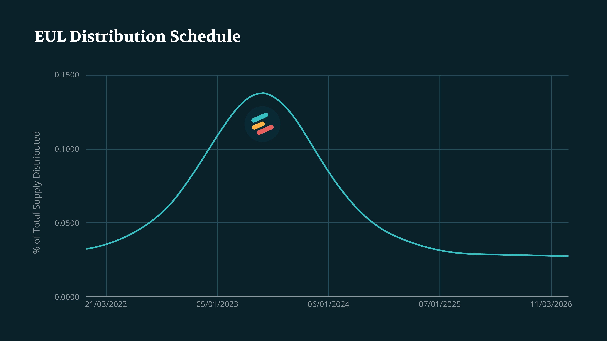

# EUL

## Introduction

EUL tokens represent voting powers to effect change over the protocol code. EUL is an ERC20 token that acts as the native [governance](../governance/) token of the Euler Protocol. The EUL token address is: `0xd9Fcd98c322942075A5C3860693e9f4f03AAE07b`.&#x20;

More information about EUL can be found on [Etherscan](https://etherscan.io/token/0xd9fcd98c322942075a5c3860693e9f4f03aae07b), [CoinMarketCap](https://coinmarketcap.com/currencies/euler-finance/) or [CoinGecko](https://www.coingecko.com/en/coins/euler).

## Breakdown

The total supply of EUL is 27,182,818 (in homage to Euler’s number, [e](https://en.wikipedia.org/wiki/E\_\(mathematical\_constant\))). The initial four-year breakdown of the EUL total supply is as follows:

* **25%** (6,795,705 EUL) to users who borrow on community-selected markets on Euler protocol over 4 years (see [Distribution](distribution.md)).
* **1%** (271,828 EUL) to all users who deposited or borrowed assets on Euler during its soft launch (see [Epoch0](distribution-1.md#epoch-0)).
* **13.83%** (3,759,791 EUL) to the Euler Treasury, unlocked (see [Treasury](../treasury.md)).
* **25.85%** (7,026,759 EUL) to Euler Labs shareholders, with an 18 month linear unlock schedule starting on 01/01/2022.
* **9.67%** (2,628,170 EUL) to partners of EulerDAO, with an 18 month linear unlock schedule starting on 01/01/2022.
* **4%** (1,087,313 EUL) to Encode, an early project incubator, with a linear 30 month unlock schedule starting on 01/01/2022.
* **20.65%** (5,613,252 EUL) to employees, advisors and consultants of Euler Labs. Co-founders with a 48 month linear unlock schedule starting on 01/01/2022. All others with individual agreements.

Here is the breakdown:

.png>)

The unlock schedule for different groups is as follows:

.png>)

Note that the initial allocations may be subject to change as the ecosystem evolves. As EUL is distributed to users of the protocol they may see fit to vote to alter the EUL Distribution, for example.

The total supply of EUL is fixed for the first 4 years, after which EUL token holders may enact a governance proposal to inflate the supply by a maximum 2.718% per year. In that scenario, newly minted EUL will enter circulation via the [Treasury](../treasury.md).

## Circulating Supply

The approximate schedule for the circulating supply of EUL is shown below.

##
