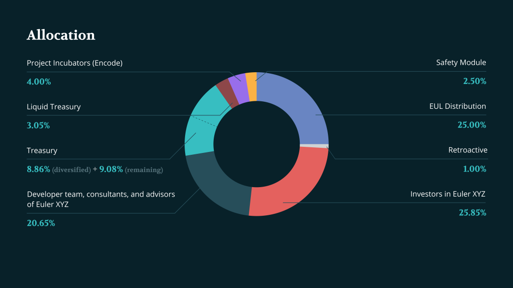

# EUL

## Introduction

EUL is an ERC20 token that acts as the native [governance](../governance/) token of the Euler Protocol. The EUL token address is: `0xd9Fcd98c322942075A5C3860693e9f4f03AAE07b`. More information about EUL can be found on [Etherscan](https://etherscan.io/token/0xd9fcd98c322942075a5c3860693e9f4f03aae07b) or [CoinMarketCap](https://coinmarketcap.com/currencies/euler-finance/).

## Allocations & Vesting

The total supply of EUL is 27,182,818 (in homage to Euler’s number, [e](https://en.wikipedia.org/wiki/E\_\(mathematical\_constant\))). The initial four-year allocation of the EUL total supply is as follows:

* **25%** (6,795,705 EUL) to users who borrow on community-selected markets on Euler protocol over 4 years (see [Distribution](distribution.md)).
* **1%** (271,828 EUL) to all users who deposited or borrowed assets on Euler during its soft launch (see [Epoch0](distribution-1.md#epoch-0)).
* **2.5%** (679,570 EUL) to users staking EUL to a safety staking pool over 4 years (see [Safety Module](../../security/vault.md)).
* **9.082%** (2,468,672 EUL) to an ecosystem treasury, unlocked (see [Treasury](../treasury.md)).
* **8.869%** (2,410,708 EUL) to governance partners who helped to diversify the Treasury (see [Diversification](../treasury.md#diversification)), with an 18 month linear vesting schedule starting on 01/01/2022.
* **3.05%** (829,013 EUL) liquid assets deployed by the Treasury.
* **25.85%** (7,026,759 EUL) to investors in Euler XYZ Ltd, with an 18 month linear vesting schedule starting on 01/01/2022.
* **4%** (1,087,313 EUL) \*\*\*\* to Encode, an early project incubator, with a linear 30 month vesting schedule starting on 01/01/2022.
* **20.65%** (5,613,252 EUL) to employees, advisors and consultants of Euler XYZ Ltd. Founders with a 48 month linear vesting schedule starting on 01/01/2022. Non-founders with individual agreements.

Here is the breakdown:

Note that the initial allocations may be subject to change as the ecosystem evolves. As EUL is distributed to users of the protocol they may see fit to vote to alter the EUL Distribution or allocations to the [Safety Module](../../security/vault.md), for example.

The total supply of EUL is fixed for the first 4 years, after which EUL token holders may enact a governance proposal to inflate the supply by a maximum 2.718% per year. In that scenario, newly minted EUL will enter circulation via the [Treasury](../treasury.md).

## Inflation & Liquid Supply

The approximate schedule for the inflation of the liquid supply of EUL is shown below.

**Note:** EUL tokens cannot currently be transferred pending establishment of the Euler Foundation and the ecosystem treasury.

The schedule for the EUL Distribution tries to match increasing protocol user numbers after launch with a concomitant increase in the EUL distribution, which should help to decentralise supply of the token. The graph below shows the amount of EUL distributed by through the programme as a % of the total supply.

##
