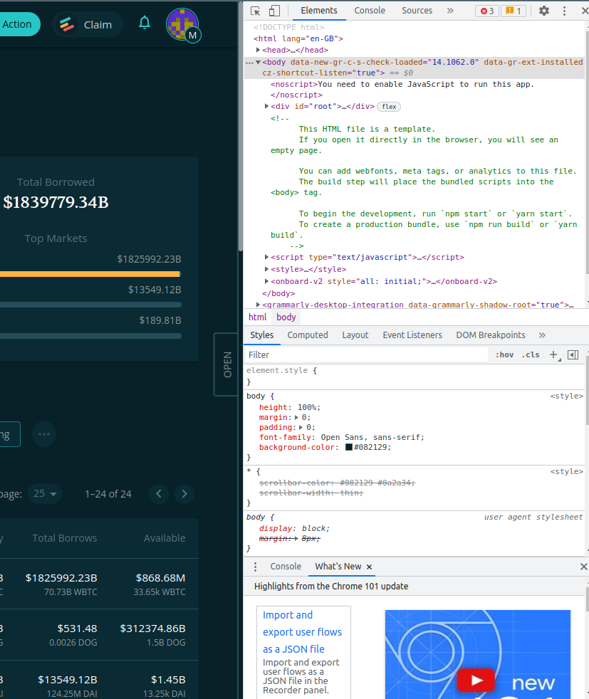
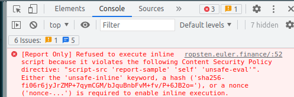
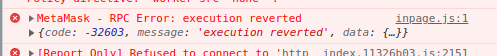

# Retrieve Browser Errors

Here are step-by-step instructions:

* Open the developer console by pressing Option + ⌘ + J (on macOS) or Shift + CTRL + J (on Windows/Linux). You can open it by right-clicking anywhere on the webpage and selecting Inspect Element option.
*   On the top of the developer panel, there are multiple tabs like Elements, Console, Networks, and Sources.

    
*   Click on the Console tab

    
*   Console is a place where we have all errors, warnings and general logs that appeared during the run time of the website.

    
*   You will find the current errors in red text with a specific error code, the cause, and the file name and line number where this error occurred.

    
