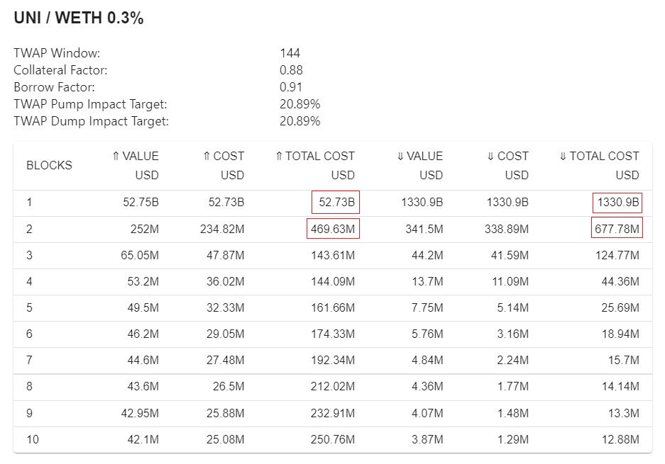

# Oracle Rating

## **What is an oracle?**

Within the context of pricing, an oracle is an on-chain API for price. Differently put, it simply tells you what the price of an asset is at a given time.&#x20;

## Oracle Risk

While we think Uniswap's oracles are best suited for our permissionless lending protocol, depositing into an Euler pool backed by illiquid liquidity pools on Uniswap can lead to devastating results.&#x20;

For instance, inflating the value of a collateral allows the attacker to borrow an inflated amount of tokens, leading to bad debt. This is the most systemic and widespread attack on lending protocols.

Alternatively, if the Uniswap V3 oracle of the borrowed asset is manipulated to the upside, the attack could trigger liquidations and sweep borrowers' collateral.&#x20;

Even more of concern is when the attacker can manipulate the asset pricing to the downside. Hypothetically, if the price drops to almost zero, the attacker only needs a small amount of collateral to borrow the entire pool and run away with a hefty profit.&#x20;

## Euler’s Oracle Risk Grading System

In order to assess an oracle's safety, our team have developed a tool to calculate the cost of moving a given Uniswap v3 TWAP: [oracle.euler.finance](https://oracle.euler.finance/).

Using the tool, we can calculate the cost of moving the TWAP by 20.89% (minimum required to break even on highest-quality assets) up and down over 1 and 2 blocks:

Then, we take the minimum of these 4 values: $469.63 million and assign a rating to it according to this table:

 (1).png>)

Consequently, UNI/WETH pool safety is deemed **high** as the minimum cost of attack up and down over 1-2 blocks is > $50 million.

This is displayed on the front-end page of the respective lending pool:

_**Keep in mind that this is merely an indicative tool and we bear no responsibility for loss of funds.**_

## **How to Improve the Oracle Rating?**

If you are a project that wants to improve its token's oracle rating and be eligible for higher borrow and collateral factors, it's crucial to _**provide full-range liquidity to the XYZ/WETH pair on Uniswap V3.**_&#x20;

By **full-range liquidity** we mean providing liquidity **from the lowest tick all the way to the highest tick** without any gaps in between.&#x20;

A good example is [METIS/WETH](https://info.uniswap.org/#/pools/0x1c98562a2fab5af19d8fb3291a36ac3c618835d9):

.png>)

A suboptimal scenario is [HEGIC/WETH](https://info.uniswap.org/#/pools/0xf2c3bd0328bdb6106d34a3bd0df0ef744551cc82), where liquidity is uber-concentrated:

.png>)

Check out this [video](https://www.youtube.com/watch?v=snwUwj3QQ7M\&t=1s\&ab\_channel=EulerFinance)going through different manipulation scenarios for a more in-depth explanation:&#x20;

It's important to note **that even a small amount of fully-spread liquidity can significantly increase the cost of attack**. For eg, the[IDLE/WETH](https://info.uniswap.org/#/pools/0x79e42a2bb91a0f9118e2b5231958c1eaefce390c) pool has a mere $52k TVL, yet the minimum cost of attack is a whopping $115 million:

.png>)

## References

Check out this blog post written by Darek explaining the oracle tool: [https://blog.euler.finance/uniswap-oracle-attack-simulator-42d18adf65af](https://blog.euler.finance/uniswap-oracle-attack-simulator-42d18adf65af)

Check out Michael's paper on how even a small amount of full-range liquidity can make an attack incredibly costly: [https://github.com/euler-xyz/uni-v3-twap-manipulation/blob/master/cost-of-attack.pdf](https://github.com/euler-xyz/uni-v3-twap-manipulation/blob/master/cost-of-attack.pdf)
